# DOC – FitPass Gym Management
**Alunos:** Henrique Molinari | Eduardo Lima  
**Disciplina:** Engenharia de Software  
**Documento:** Documentação Unificada de Casos de Uso, Diagramas de Caso de Uso e Diagramas de Atividade

---

## Sumário

1. [Diagramas de Caso de Uso](#1-diagramas-de-caso-de-uso)
2. [Documentação dos Casos de Uso](#2-documentação-dos-casos-de-uso)
3. [Diagramas de Atividade](#3-diagramas-de-atividade)

---

## 1. Diagramas de Caso de Uso

Os diagramas abaixo representam os 20 casos de uso identificados para o sistema FitPass Gym Management, organizados em três agrupamentos lógicos.

---

### DUC_01 – Gestão e Acesso


**Atores:** Recepcionista, Gerente, Sistema de Catraca (API)

**Casos de uso representados:**
- UC01 – Cadastrar Aluno
- UC02 – Gerenciar Planos
- UC04 – Editar Cadastro Aluno
- UC05 – Verificar Regularidade
- UC09 – Validar Acesso Catraca
- UC17 – Emitir Relatório Gerencial
- UC18 – Relatório Ocupação Aulas
- UC19 – Consultar Histórico Acessos

---

### DUC_02 – Treino e Aulas


**Atores:** Aluno, Instrutor, Gerente

**Casos de uso representados:**
- UC10 – Agendar Aula
- UC11 – Confirmar Agendamento *(extend de UC10)*
- UC12 – Cancelar Agendamento
- UC13 – Registrar Presença
- UC14 – Registrar Avaliação Física
- UC15 – Notificar Liberação Avaliação *(extend de UC14)*
- UC16 – Consultar Avaliação Física
- UC18 – Relatório Ocupação Aulas

---

### DUC_03 – Financeiro e Core


**Atores:** Aluno, Recepcionista, Gerente, Usuário

**Casos de uso representados:**
- UC03 – Realizar Login
- UC06 – Registrar Pagamento
- UC07 – Gerar Cobrança Online
- UC08 – Notificar Vencimento
- UC11 – Confirmar Agendamento
- UC15 – Notificar Avaliação
- UC17 – Emitir Relatório Gerencial
- UC20 – Realizar Logout

---

## 2. Documentação dos Casos de Uso

---

### UC01 – Cadastrar Aluno

| Campo | Descrição |
|---|---|
| **Ator principal** | Recepcionista |
| **Pré-condições** | Recepcionista autenticado no sistema |
| **Pós-condições** | Novo aluno cadastrado e vinculado a um plano |

**Fluxo Principal:**
1. Recepcionista acessa o módulo de cadastro.
2. Sistema exibe o formulário de cadastro.
3. Recepcionista preenche: nome, CPF, data de nascimento, contato, endereço e plano contratado.
4. Sistema valida os dados informados.
5. Sistema registra o novo aluno.
6. Sistema exibe confirmação do cadastro.

**Fluxos Alternativos:**
- **FA01 – CPF já cadastrado:** Sistema exibe mensagem de duplicidade e solicita revisão.
- **FA02 – Campos obrigatórios em branco:** Sistema destaca os campos e bloqueia o envio.

**Requisitos relacionados:** RF01  
**Requisitos não funcionais:** RNF02, RNF04  
**Regras de negócio:** —

---

### UC02 – Gerenciar Planos

| Campo | Descrição |
|---|---|
| **Ator principal** | Gerente |
| **Pré-condições** | Gerente autenticado no sistema |
| **Pós-condições** | Plano criado, editado, ativado ou desativado conforme ação |

**Fluxo Principal:**
1. Gerente acessa o módulo de configuração de planos.
2. Sistema lista os planos existentes.
3. Gerente seleciona a ação desejada (criar, editar, ativar ou desativar).
4. Sistema exibe o formulário correspondente.
5. Gerente preenche ou altera os dados do plano.
6. Sistema salva e confirma a operação.

**Fluxos Alternativos:**
- **FA01 – Desativar plano com alunos vinculados:** Sistema exibe aviso e solicita confirmação antes de prosseguir.

**Requisitos relacionados:** RF02  
**Requisitos não funcionais:** RNF04, RNF05  
**Regras de negócio:** RN06

---

### UC03 – Realizar Login

| Campo | Descrição |
|---|---|
| **Ator principal** | Usuário (Aluno, Recepcionista, Instrutor ou Gerente) |
| **Pré-condições** | Usuário possui cadastro ativo no sistema |
| **Pós-condições** | Usuário autenticado e redirecionado para seu painel conforme perfil |

**Fluxo Principal:**
1. Usuário acessa a tela de login.
2. Usuário informa e-mail e senha.
3. Sistema valida as credenciais.
4. Sistema identifica o perfil do usuário.
5. Sistema redireciona para o painel correspondente.

**Fluxos Alternativos:**
- **FA01 – Credenciais inválidas:** Sistema exibe mensagem de erro e permite nova tentativa.
- **FA02 – Conta bloqueada:** Sistema informa bloqueio e orienta o contato com a recepção.

**Requisitos relacionados:** RF04  
**Requisitos não funcionais:** RNF02, RNF03  
**Regras de negócio:** RN06

---

### UC04 – Editar Cadastro Aluno

| Campo | Descrição |
|---|---|
| **Ator principal** | Recepcionista |
| **Pré-condições** | Recepcionista autenticado; aluno já cadastrado |
| **Pós-condições** | Dados do aluno atualizados no sistema |

**Fluxo Principal:**
1. Recepcionista pesquisa o aluno pelo nome ou CPF.
2. Sistema exibe os dados atuais do aluno.
3. Recepcionista altera os campos desejados.
4. Sistema valida as alterações.
5. Sistema salva e confirma a atualização.

**Fluxos Alternativos:**
- **FA01 – Aluno não encontrado:** Sistema exibe mensagem e sugere novo cadastro.

**Requisitos relacionados:** RF01  
**Requisitos não funcionais:** RNF02, RNF04  
**Regras de negócio:** —

---

### UC05 – Verificar Regularidade

| Campo | Descrição |
|---|---|
| **Ator principal** | Recepcionista |
| **Pré-condições** | Aluno localizado no sistema |
| **Pós-condições** | Status de regularidade exibido na tela |

**Fluxo Principal:**
1. Recepcionista pesquisa o aluno.
2. Sistema consulta o histórico de pagamentos.
3. Sistema verifica se há mensalidade em atraso.
4. Sistema exibe o status: "Regular" ou "Inadimplente".

**Fluxos Alternativos:**
- **FA01 – Aluno inadimplente:** Sistema destaca o status em vermelho e indica a data do vencimento.

**Requisitos relacionados:** RF04  
**Requisitos não funcionais:** RNF03  
**Regras de negócio:** RN01, RN07

---

### UC06 – Registrar Pagamento

| Campo | Descrição |
|---|---|
| **Ator principal** | Recepcionista |
| **Pré-condições** | Recepcionista autenticado; aluno localizado no sistema |
| **Pós-condições** | Pagamento registrado; situação do aluno atualizada para regular |

**Fluxo Principal:**
1. Recepcionista acessa o módulo financeiro.
2. Recepcionista pesquisa e seleciona o aluno.
3. Recepcionista informa o valor e a forma de pagamento (dinheiro, cartão ou PIX).
4. Sistema valida o valor (deve ser integral).
5. Sistema registra o pagamento.
6. Sistema atualiza automaticamente a regularidade do aluno.
7. Sistema emite comprovante.

**Fluxos Alternativos:**
- **FA01 – Valor parcial informado:** Sistema bloqueia o registro e exibe mensagem de restrição.

**Requisitos relacionados:** RF03, RF04  
**Requisitos não funcionais:** RNF02, RNF03  
**Regras de negócio:** RN04, RN07

---

### UC07 – Gerar Cobrança Online

| Campo | Descrição |
|---|---|
| **Ator principal** | Sistema (automático) / Aluno |
| **Pré-condições** | Aluno cadastrado com mensalidade próxima ao vencimento |
| **Pós-condições** | Boleto ou link de pagamento gerado e disponibilizado ao aluno |

**Fluxo Principal:**
1. Sistema identifica alunos com mensalidade a vencer.
2. Sistema gera boleto ou QR Code PIX.
3. Sistema envia o link/boleto ao aluno por e-mail ou notificação no app.
4. Aluno realiza o pagamento.
5. Sistema confirma o pagamento e atualiza a regularidade.

**Fluxos Alternativos:**
- **FA01 – Falha no envio da notificação:** Sistema registra a falha e tenta reenviar.

**Requisitos relacionados:** RF03, RF10  
**Requisitos não funcionais:** RNF02, RNF06  
**Regras de negócio:** RN04, RN07

---

### UC08 – Notificar Vencimento

| Campo | Descrição |
|---|---|
| **Ator principal** | Sistema (automático) |
| **Pré-condições** | Aluno cadastrado com mensalidade próxima ao vencimento |
| **Pós-condições** | Aluno notificado sobre o vencimento da mensalidade |

**Fluxo Principal:**
1. Sistema verifica diariamente as datas de vencimento.
2. Sistema identifica alunos com vencimento nos próximos dias.
3. Sistema envia notificação push e/ou e-mail ao aluno.
4. Sistema registra o envio da notificação.

**Fluxos Alternativos:**
- **FA01 – Aluno sem e-mail ou app configurado:** Sistema registra a impossibilidade de notificação.

**Requisitos relacionados:** RF10  
**Requisitos não funcionais:** RNF01  
**Regras de negócio:** RN01

---

### UC09 – Validar Acesso Catraca

| Campo | Descrição |
|---|---|
| **Ator principal** | Sistema de Catraca (API) |
| **Pré-condições** | Aluno apresenta cartão/tag RFID na catraca |
| **Pós-condições** | Acesso liberado ou bloqueado; evento registrado |

**Fluxo Principal:**
1. Aluno aproxima o cartão RFID da catraca.
2. Sistema de catraca envia requisição REST com o ID do aluno.
3. Sistema FitPass valida se o aluno está ativo e regular.
4. Sistema retorna resposta: liberar ou bloquear acesso.
5. Sistema registra o evento de acesso.

**Fluxos Alternativos:**
- **FA01 – Aluno inadimplente:** Sistema retorna bloqueio; catraca permanece fechada.
- **FA02 – ID não reconhecido:** Sistema retorna erro; catraca permanece fechada.

**Requisitos relacionados:** RF04, RF05  
**Requisitos não funcionais:** RNF03, RNF06  
**Regras de negócio:** RN01

---

### UC10 – Agendar Aula

| Campo | Descrição |
|---|---|
| **Ator principal** | Aluno |
| **Pré-condições** | Aluno autenticado e com mensalidade regular |
| **Pós-condições** | Vaga reservada na aula escolhida |

**Fluxo Principal:**
1. Aluno acessa o módulo de aulas.
2. Sistema exibe as aulas disponíveis com horários e vagas restantes.
3. Aluno seleciona a aula desejada.
4. Sistema verifica disponibilidade de vagas.
5. Sistema registra o agendamento.
6. Sistema aciona UC11 – Confirmar Agendamento.

**Fluxos Alternativos:**
- **FA01 – Aula sem vagas:** Sistema informa lotação e não permite o agendamento.
- **FA02 – Aluno inadimplente:** Sistema bloqueia o agendamento.

**Requisitos relacionados:** RF06  
**Requisitos não funcionais:** RNF03, RNF04  
**Regras de negócio:** RN01, RN02

---

### UC11 – Confirmar Agendamento

| Campo | Descrição |
|---|---|
| **Ator principal** | Sistema (automático) |
| **Pré-condições** | Agendamento realizado com sucesso em UC10 |
| **Pós-condições** | Aluno notificado sobre a confirmação do agendamento |

**Fluxo Principal:**
1. Sistema registra o agendamento.
2. Sistema gera confirmação com dados da aula (data, horário, instrutor).
3. Sistema envia notificação ao aluno.

**Fluxos Alternativos:**
- **FA01 – Falha no envio:** Sistema registra e tenta reenviar.

**Requisitos relacionados:** RF06, RF10  
**Requisitos não funcionais:** RNF01  
**Regras de negócio:** —

---

### UC12 – Cancelar Agendamento

| Campo | Descrição |
|---|---|
| **Ator principal** | Aluno |
| **Pré-condições** | Aluno autenticado; agendamento ativo |
| **Pós-condições** | Agendamento cancelado; vaga liberada |

**Fluxo Principal:**
1. Aluno acessa seus agendamentos.
2. Sistema lista os agendamentos ativos.
3. Aluno seleciona o agendamento e solicita cancelamento.
4. Sistema verifica se o cancelamento está dentro do prazo permitido (até 1 hora antes).
5. Sistema cancela o agendamento e libera a vaga.
6. Sistema confirma o cancelamento para o aluno.

**Fluxos Alternativos:**
- **FA01 – Fora do prazo de cancelamento:** Sistema bloqueia a ação e informa a restrição.

**Requisitos relacionados:** RF06  
**Requisitos não funcionais:** RNF03  
**Regras de negócio:** RN03

---

### UC13 – Registrar Presença

| Campo | Descrição |
|---|---|
| **Ator principal** | Instrutor |
| **Pré-condições** | Instrutor autenticado; aula em andamento |
| **Pós-condições** | Presença dos alunos registrada |

**Fluxo Principal:**
1. Instrutor acessa o módulo de aulas.
2. Sistema exibe a lista de alunos agendados para a aula em curso.
3. Instrutor marca os alunos presentes.
4. Sistema registra a lista de presença com data e horário.

**Fluxos Alternativos:**
- **FA01 – Aluno não agendado presente:** Instrutor pode adicionar manualmente; sistema registra como entrada avulsa.

**Requisitos relacionados:** RF07  
**Requisitos não funcionais:** RNF03, RNF04  
**Regras de negócio:** RN06

---

### UC14 – Registrar Avaliação Física

| Campo | Descrição |
|---|---|
| **Ator principal** | Instrutor |
| **Pré-condições** | Instrutor autenticado; aluno ativo e regular |
| **Pós-condições** | Avaliação física registrada; aluno notificado |

**Fluxo Principal:**
1. Instrutor acessa o módulo de avaliações.
2. Instrutor pesquisa e seleciona o aluno.
3. Sistema verifica se o aluno está ativo e regular.
4. Instrutor registra os dados: peso, IMC, percentual de gordura, entre outros.
5. Instrutor anexa arquivos, se necessário.
6. Sistema salva a avaliação.
7. Sistema aciona UC15 – Notificar Liberação Avaliação.

**Fluxos Alternativos:**
- **FA01 – Aluno irregular ou inativo:** Sistema bloqueia o registro e exibe mensagem informativa.

**Requisitos relacionados:** RF08  
**Requisitos não funcionais:** RNF02, RNF04  
**Regras de negócio:** RN05, RN06

---

### UC15 – Notificar Liberação Avaliação

| Campo | Descrição |
|---|---|
| **Ator principal** | Sistema (automático) |
| **Pré-condições** | Avaliação registrada em UC14 |
| **Pós-condições** | Aluno notificado sobre disponibilidade da avaliação |

**Fluxo Principal:**
1. Sistema identifica o registro da nova avaliação.
2. Sistema gera notificação para o aluno.
3. Sistema envia via push e/ou e-mail.

**Fluxos Alternativos:**
- **FA01 – Falha no envio:** Sistema registra e agenda novo envio.

**Requisitos relacionados:** RF10  
**Requisitos não funcionais:** RNF01  
**Regras de negócio:** —

---

### UC16 – Consultar Avaliação Física

| Campo | Descrição |
|---|---|
| **Ator principal** | Aluno |
| **Pré-condições** | Aluno autenticado; avaliação registrada pelo instrutor |
| **Pós-condições** | Dados da avaliação exibidos para o aluno |

**Fluxo Principal:**
1. Aluno acessa o módulo de avaliações.
2. Sistema exibe o histórico de avaliações do aluno.
3. Aluno seleciona a avaliação desejada.
4. Sistema exibe os detalhes completos (peso, IMC, percentual de gordura, arquivos anexos).

**Fluxos Alternativos:**
- **FA01 – Nenhuma avaliação registrada:** Sistema informa que não há registros disponíveis.

**Requisitos relacionados:** RF08  
**Requisitos não funcionais:** RNF03, RNF04  
**Regras de negócio:** —

---

### UC17 – Emitir Relatório Gerencial

| Campo | Descrição |
|---|---|
| **Ator principal** | Gerente |
| **Pré-condições** | Gerente autenticado no sistema |
| **Pós-condições** | Relatório gerado e disponibilizado para download ou visualização |

**Fluxo Principal:**
1. Gerente acessa o módulo de relatórios.
2. Sistema exibe as opções: inadimplência, alunos ativos, histórico de acessos, ocupação das aulas.
3. Gerente seleciona o tipo de relatório e os filtros desejados (período, unidade).
4. Sistema processa os dados.
5. Sistema exibe o relatório e disponibiliza opção de exportação.

**Fluxos Alternativos:**
- **FA01 – Sem dados no período:** Sistema informa ausência de registros para os filtros aplicados.

**Requisitos relacionados:** RF09  
**Requisitos não funcionais:** RNF03, RNF05  
**Regras de negócio:** RN06

---

### UC18 – Relatório Ocupação Aulas

| Campo | Descrição |
|---|---|
| **Ator principal** | Gerente |
| **Pré-condições** | Gerente autenticado no sistema |
| **Pós-condições** | Relatório de ocupação das aulas exibido |

**Fluxo Principal:**
1. Gerente acessa o módulo de relatórios.
2. Gerente seleciona o relatório de ocupação de aulas.
3. Gerente define os filtros: período e/ou modalidade.
4. Sistema consulta os registros de agendamento e presença.
5. Sistema exibe o relatório com percentual de ocupação por aula.

**Fluxos Alternativos:**
- **FA01 – Sem aulas no período:** Sistema informa ausência de dados.

**Requisitos relacionados:** RF09  
**Requisitos não funcionais:** RNF03, RNF05  
**Regras de negócio:** RN06

---

### UC19 – Consultar Histórico Acessos

| Campo | Descrição |
|---|---|
| **Ator principal** | Gerente |
| **Pré-condições** | Gerente autenticado no sistema |
| **Pós-condições** | Histórico de acessos à academia exibido |

**Fluxo Principal:**
1. Gerente acessa o módulo de relatórios.
2. Gerente seleciona a opção "Histórico de Acessos".
3. Gerente aplica filtros: aluno, período ou data específica.
4. Sistema consulta os registros de entrada/saída.
5. Sistema exibe a lista de acessos com data, horário e status.

**Fluxos Alternativos:**
- **FA01 – Sem registros no período:** Sistema informa ausência de dados.

**Requisitos relacionados:** RF05, RF09  
**Requisitos não funcionais:** RNF03  
**Regras de negócio:** —

---

### UC20 – Realizar Logout

| Campo | Descrição |
|---|---|
| **Ator principal** | Usuário (qualquer perfil) |
| **Pré-condições** | Usuário autenticado no sistema |
| **Pós-condições** | Sessão encerrada; usuário redirecionado para a tela de login |

**Fluxo Principal:**
1. Usuário aciona a opção de logout.
2. Sistema encerra a sessão ativa.
3. Sistema invalida o token de autenticação.
4. Sistema redireciona para a tela de login.

**Fluxos Alternativos:**
- **FA01 – Sessão já expirada:** Sistema redireciona diretamente para login sem erro.

**Requisitos relacionados:** RF04  
**Requisitos não funcionais:** RNF02  
**Regras de negócio:** —

---

## 3. Diagramas de Atividade

Os diagramas de atividade a seguir representam os fluxos de execução de cada caso de uso em notação PlantUML. Foram adicionados também três diagramas agrupados contemplando fluxos interdependentes.

---

### DA01 – Cadastrar Aluno (UC01)

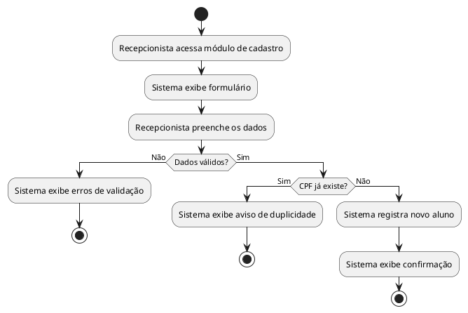

---

### DA02 – Gerenciar Planos (UC02)

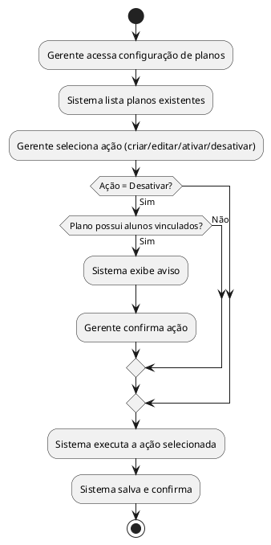

---

### DA03 – Realizar Login (UC03)

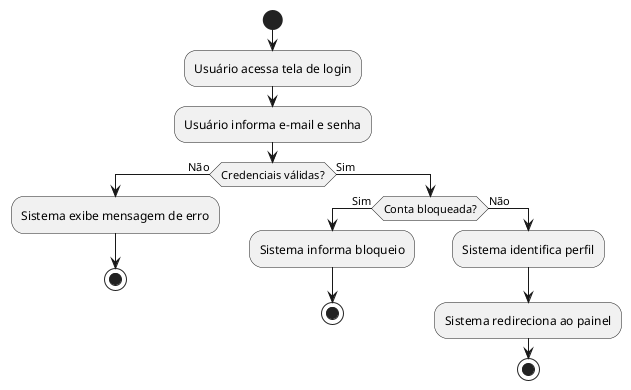

---

### DA04 – Editar Cadastro Aluno (UC04)

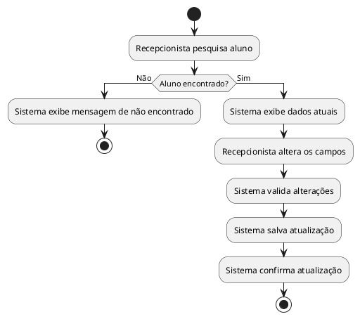

---

### DA05 – Verificar Regularidade (UC05)

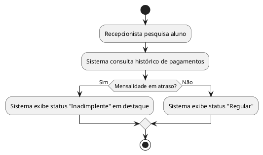

---

### DA06 – Registrar Pagamento (UC06)

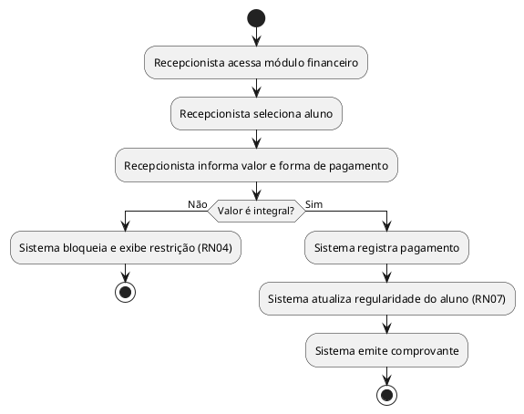

---

### DA07 – Gerar Cobrança Online (UC07)

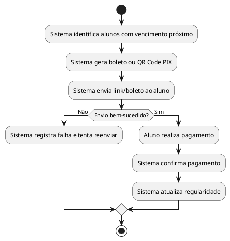

---

### DA08 – Notificar Vencimento (UC08)

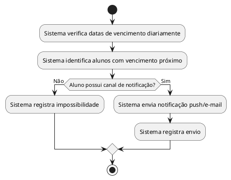

---

### DA09 – Validar Acesso Catraca (UC09)

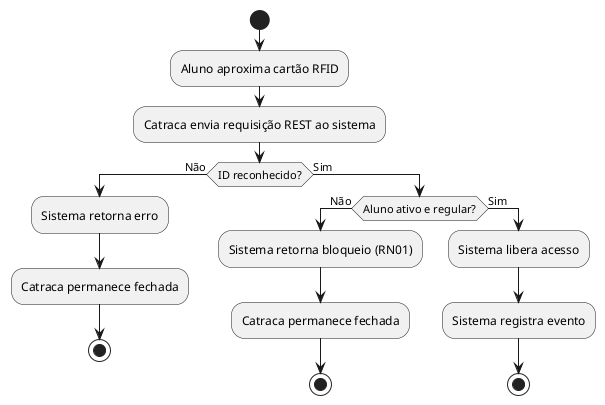

---

### DA10 – Agendar Aula (UC10)

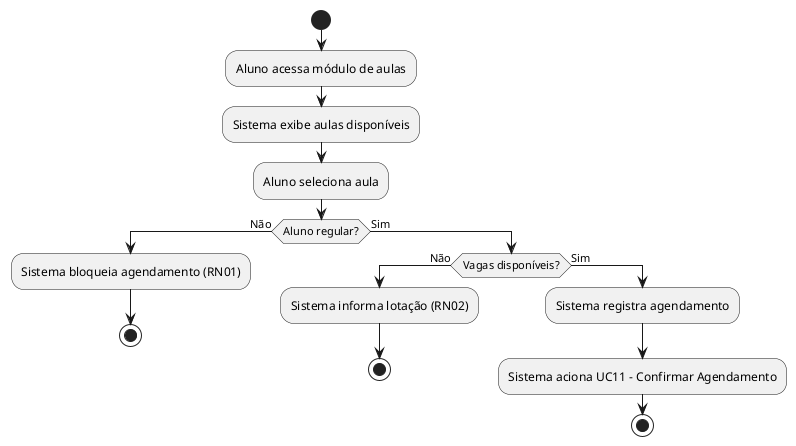

---

### DA11 – Confirmar Agendamento (UC11)

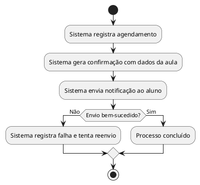

---

### DA12 – Cancelar Agendamento (UC12)

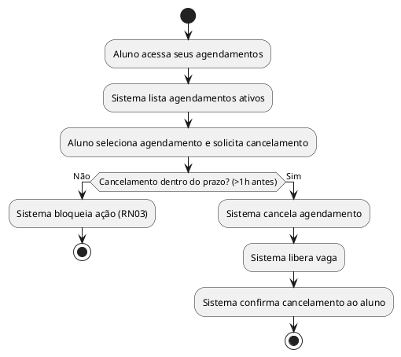

---

### DA13 – Registrar Presença (UC13)

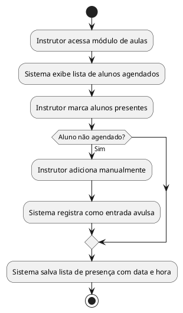

---

### DA14 – Registrar Avaliação Física (UC14)

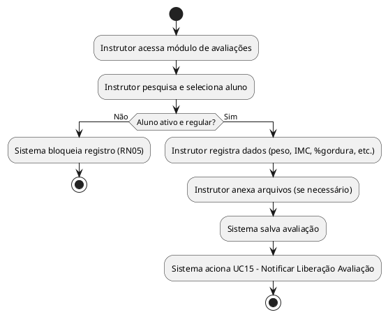

---

### DA15 – Notificar Liberação Avaliação (UC15)

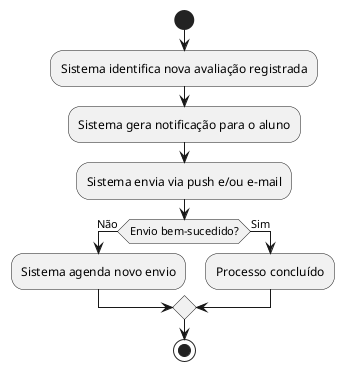

---

### DA16 – Consultar Avaliação Física (UC16)

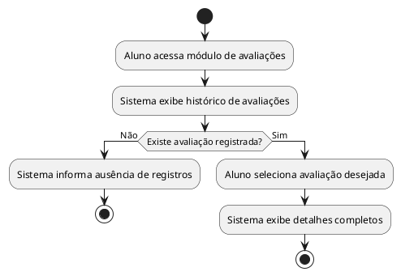

---

### DA17 – Emitir Relatório Gerencial (UC17)

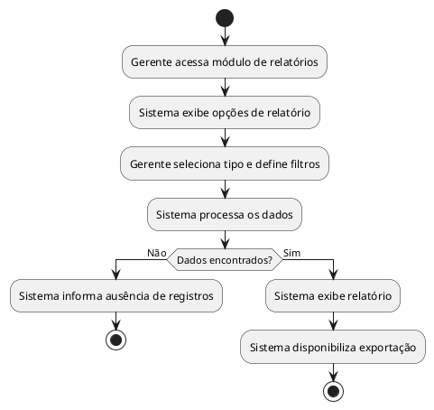

---

### DA18 – Relatório Ocupação Aulas (UC18)

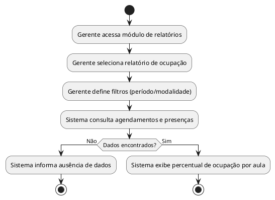

---

### DA19 – Consultar Histórico Acessos (UC19)

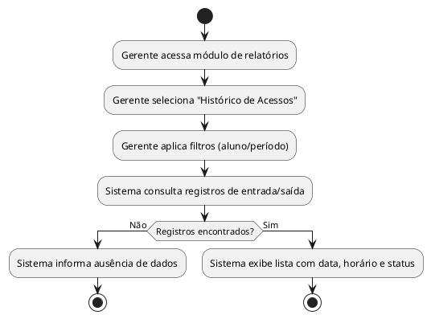

---

### DA20 – Realizar Logout (UC20)

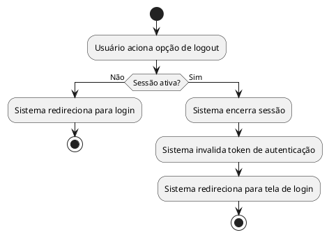

---

### DA-GRP01 – Fluxo de Acesso e Validação (UC03 + UC09 + UC05)

> Diagrama agrupado representando o ciclo completo de um aluno desde o login até a validação de acesso físico.

```plantuml
@startuml DA_GRP01_AcessoValidacao
start
:Usuário realiza login (UC03);
if (Autenticação válida?) then (Não)
  :Sistema bloqueia acesso;
  stop
else (Sim)
  :Sistema identifica perfil;
  if (Perfil = Aluno?) then (Sim)
    :Aluno se dirige à catraca;
    :Catraca envia requisição RFID (UC09);
    :Sistema verifica regularidade (UC05);
    if (Aluno regular?) then (Não)
      :Catraca bloqueada;
      stop
    else (Sim)
      :Catraca libera acesso;
      :Sistema registra entrada;
      stop
    endif
  else (Não)
    :Usuário acessa painel do seu perfil;
    stop
  endif
endif
@enduml
```

---

### DA-GRP02 – Fluxo Financeiro (UC06 + UC07 + UC08 + UC05)

> Diagrama agrupado representando o ciclo financeiro: notificação, cobrança, pagamento e atualização de regularidade.

```plantuml
@startuml DA_GRP02_FluxoFinanceiro
start
:Sistema verifica vencimentos (UC08);
:Sistema envia notificação ao aluno;
fork
  :Aluno paga na recepção (UC06);
  :Recepcionista registra pagamento;
fork again
  :Sistema gera cobrança online (UC07);
  :Aluno paga online;
end fork
:Sistema atualiza regularidade do aluno (UC05/RN07);
:Aluno liberado para acesso;
stop
@enduml
```

---

### DA-GRP03 – Fluxo de Agendamento e Aula (UC10 + UC11 + UC12 + UC13)

> Diagrama agrupado representando o ciclo completo de uma aula: agendamento, confirmação, possível cancelamento e registro de presença.

```plantuml
@startuml DA_GRP03_FluxoAgendamentoAula
start
:Aluno agenda aula (UC10);
if (Vaga disponível e aluno regular?) then (Não)
  :Sistema bloqueia agendamento;
  stop
else (Sim)
  :Sistema confirma agendamento (UC11);
  if (Aluno cancela antes de 1h?) then (Sim)
    :Sistema cancela agendamento (UC12);
    :Vaga liberada;
    stop
  else (Não)
    :Instrutor registra presença na aula (UC13);
    stop
  endif
endif
@enduml
```

---

*Documento gerado para fins acadêmicos – Disciplina de Engenharia de Software – UNIFEOB*
